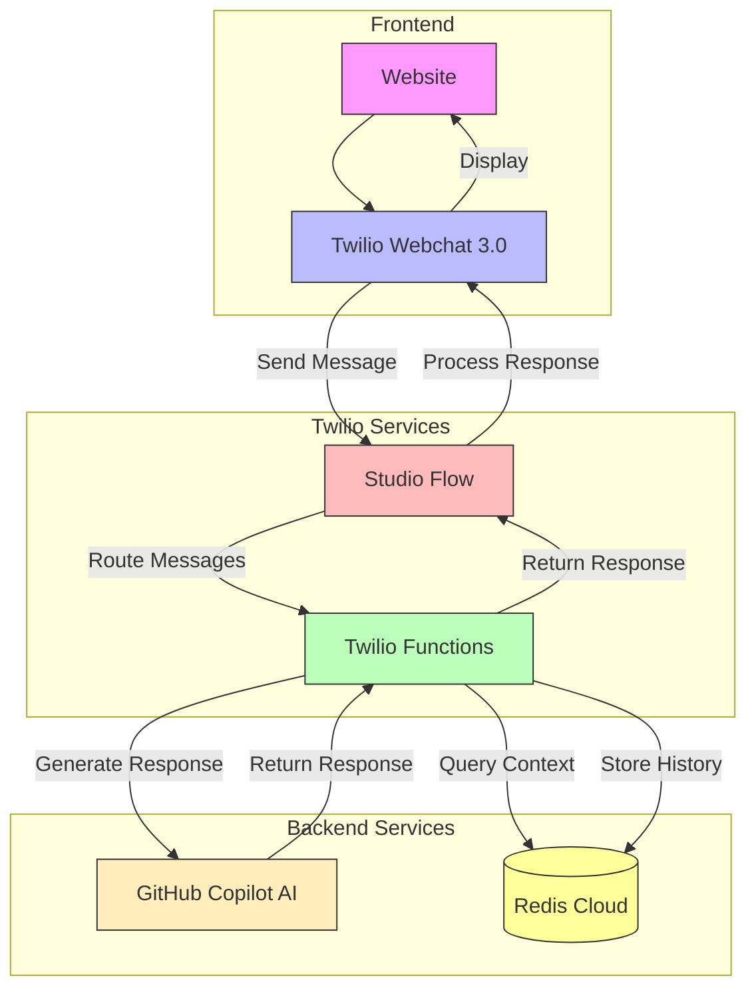

# Twilio Web Chatbot

This project is a web-based chatbot application that integrates Twilio's messaging services with OpenAI's capabilities. It provides a chat interface for users to interact with an AI-powered bot.

[Try the live demo ↗][demo]

## Features

- Real-time web chat interface - Twilio Webchat 3.0
- Integration with Twilio's converastion API
- OpenAI-powered responses
- Node.js backend server - Twilio Function

## Architecture Overview



## Technical Stack

### Chat Interface and Management
- **Twilio Webchat 3.0** [↗][twilio-webchat]
  - Provides the chat UI components
  - Handles conversation orchestration

### AI Model
- **GitHub Copilot Model** [↗][github-copilot]
  - Based on `openai/gpt-4-mini`
  - Powers natural language understanding and response generation

### Backend Integration
- **Twilio Studio Flow** [↗][twilio-studio]
  - Orchestrates conversation workflows
  - Manages message routing and flow logic
  - Handles conversation state transitions
- **Twilio Functions** [↗][twilio-functions]
  - Serverless service (similar to AWS Lambda or Azure Functions)
  - Manages integration between webchat and AI model

### Conversation Storage
- **Redis Cloud** [↗][redis-cloud]
  - Stores chat history
  - Enables contextual conversations by maintaining session state

## Prerequisites

- Node.js (v14 or higher)
- Twilio account and credentials
- OpenAI API key
- GitHub Personal Access Token

## Setup Instructions

1. Clone the repository:
   ```bash
   git clone <repository-url>
   cd twilio-web-chatbot
   ```

2. Install the dependencies:
   ```bash
   npm install
   ```

3. Create a `.env` file in the root directory follow the .env.sample

4. Run the chat-bot 
   ```bash
   npm run chat "how are you"
   ```
5. View chat history 
   ```bash
   npm run chat-history
   ```

## Contributing

1. Fork the repository
2. Create your feature branch
3. Submit a pull request

## License

This project is licensed under the MIT License.

[demo]: https://trung-t-nguyen.github.io/ttng/
[twilio-webchat]: https://www.twilio.com/docs/flex/developer/conversations/webchat
[github-copilot]: https://docs.github.com/en/github-models
[twilio-studio]: https://www.twilio.com/docs/studio
[twilio-functions]: https://www.twilio.com/docs/serverless/functions-assets/functions
[redis-cloud]: https://redis.io/cloud/